## Merging Notice

One of my lifelong friends used AI and the original version of [Ticket Auction Manager](https://github.com/ticket-auction-manager/tam) as a reference to put a fully functioning version of this together, including features I had only dreamed of and were forever on my "It'd be nice" list.

Now those items on that list are a reality. I just tested a fully functioning version of it.

This is tough to admit, but I'm impressed by AI and people who know how to use it well, as a former naysayer.

In the near future I will work with him to get the completion and feature additions cleanly merged into this repo. Which may replace this Readme file. I feel like I would be insane not to make this move and would keep the project stuck in the past, possibly never finished.

I will also add him on as a formal contributor and co-author for his efforts and credits-spend so far. You may see his name in an Authors file, and attributions of future versions of this.

---

# Ticket Auction Manager

This is Ticket Auction Manager. A project I (Dilan Gilluly) am working on as a hobby project. It's main scope is to manage in person penny socials or benefit auctions.

This is the Go version of it. The remote server (cmd/tam-server directory) and the client (cmd/tam-client directory) are written in Go, with the client's web pages written in Sveltekit (frontend directory) and built into the program, so each one is a single file that runs on Windows, Linux and macOS with nothing to install. The original version, with the server in FastAPI and Python and the client in Sveltekit, is at [ticket-auction-manager/tam](https://github.com/ticket-auction-manager/tam); the two speak the same API and use the same data files, so they can be mixed and a switch is a matter of pointing these programs at the old data folder (see [Switching from the original](#switching-from-the-original)).

Features:

- **Forms**: Facilitates the entry of data throughout the platform. The main goal of this is to allow one to manage in-person benefit auctions for non-profit causes.
  - **Ticket Form**: Enter the names and phone numbers of ticket purchasers, as well as their contact preference, which the default is controllable via the Settings screen.
  - **Basket Form**: Optionally, basket/item descriptions can be added as well as who the donor(s) are for each one. The descriptions appear on the reports later on.
  - **Drawing Form**: Use this form to enter the winning ticket numbers. The form automatically looks up if an entry exists when a field is changed and will populate the information next to it if it does.
- **Reports**: Reports are automatically generated with one click to avoid line shifts or other issues which may arise during compilation.
  - **By Name Report**: This report orders the lines by the last name of each winner, then first name, phone number, and finally basket number.
  - **By Basket Report**: Orders winners by basket number.
  - **Counts Report**: Displays counts of ticket sales by prefix as well as totals.
  - **Print Sheets**: Prints blank ticket sheets for a prefix, numbered, to write on at the door.
  - **Ticket Search**: Finds tickets across every prefix by name or phone number, and lets you correct them in place.
- **Settings**:
  - **Settings section**: The Admin/settings section can be accessed on the main menu by pressing Alt(option)+A. The combination toggles it so if you want it to go away again, just press Alt(option)+A again. It also holds the Shut Down TAM button, which stops the program on this computer.
  - **Settings page**: Allows you to control the base options of the operation. Including the server to pair with (leave it out for standalone(offline) mode), remote port, TLS, default contact preference, and the name of the venue/benefit (appears on main menu as well as reports).
  - **Auth Keys**: Allows you to manage auth keys if it's in remote mode. To do so, you need to know the auth password on the server.
  - **Prefixes**: Allows you to add or change prefixes which are available on the main menu to be able to access the respective forms for each prefix. Note, **you need to add prefixes through this form after first installation of either client or server to be able to access forms and reports.**
  - **Backup/Restore**: Downloads the data of this computer or of the server as one file, and restores such a file into either.
- **Remote Mode**: Remote mode, which is configurable in the Settings screen, allows data to be synched across multiple computers for large scale operations. Servers on the venue's network show up in the Settings screen by name, and pairing is done by entering the server password once. A computer that loses the server keeps working from its own copy of the data, queues what it saves, and delivers it when the server is back; the bar at the top of every page says Connected, Reconnecting or Offline, and how many saves are waiting.
- **Server admin page**: The server has its own pages in the browser, protected by the server password, which is set on the first visit. The Status page lists every paired computer with whether it is connected, when it was last seen, when it last saved, and how many saves it still has to deliver, so you can tell when everyone has caught up. Keys, backups and the password are managed there as well.
- **Runs everywhere**: One program per machine. On Windows an exe with an icon in the notification area; on Linux a `.deb`, an `.rpm` or a tarball with systemd units; on macOS with launchd files; or Docker. TLS is built in.

## Screenshots

The client, on a computer paired with a server (the bar at the top says so):

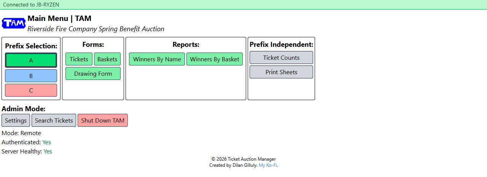

The Ticket Form. Rows are loaded by the pager at the top, and the row buttons duplicate, copy and paste entries:

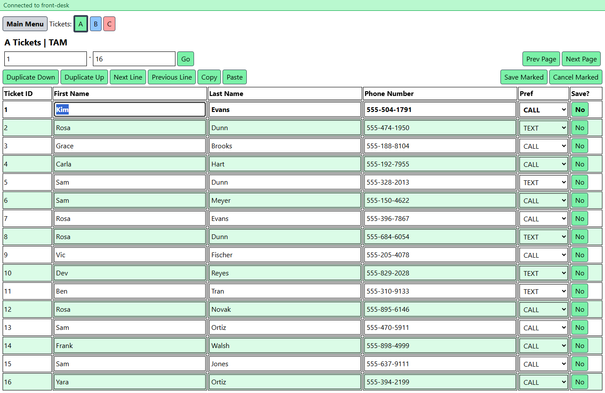

The Basket Form and the Drawing Form. The Drawing Form looks the winner up as the ticket number is typed:

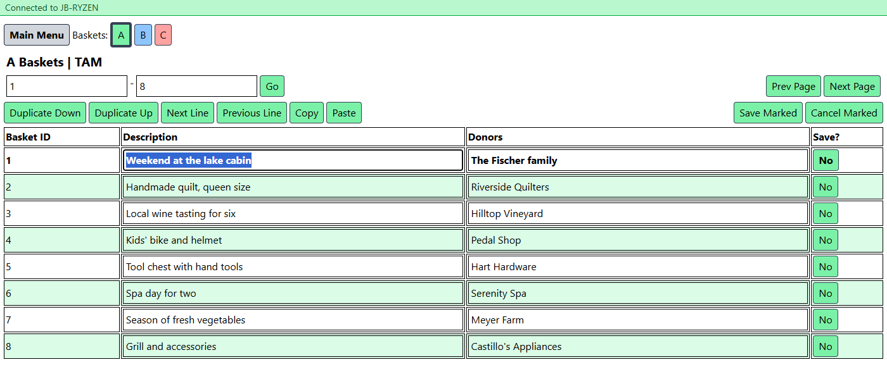

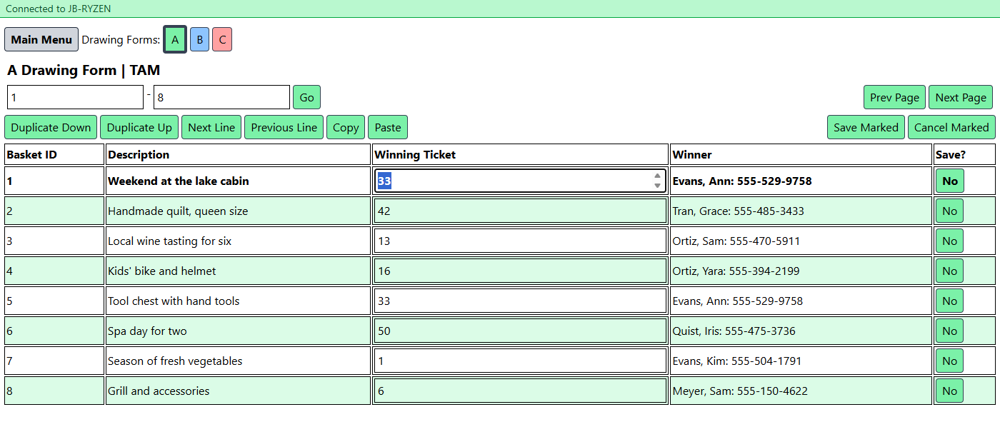

The reports:

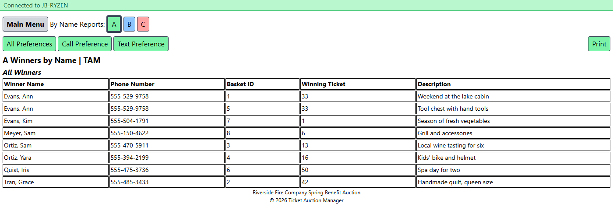

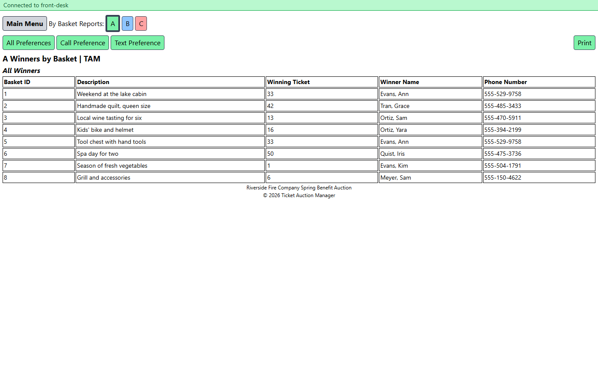

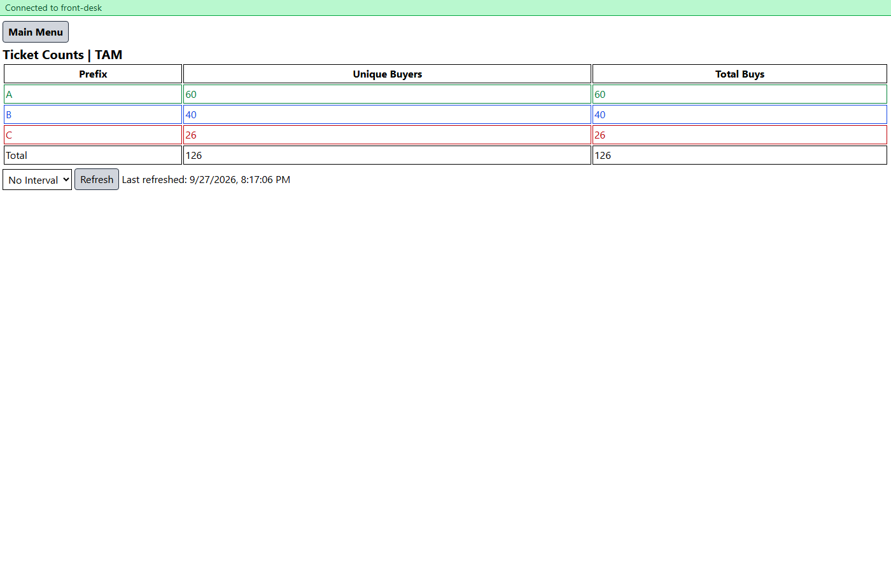

Ticket search across every prefix:

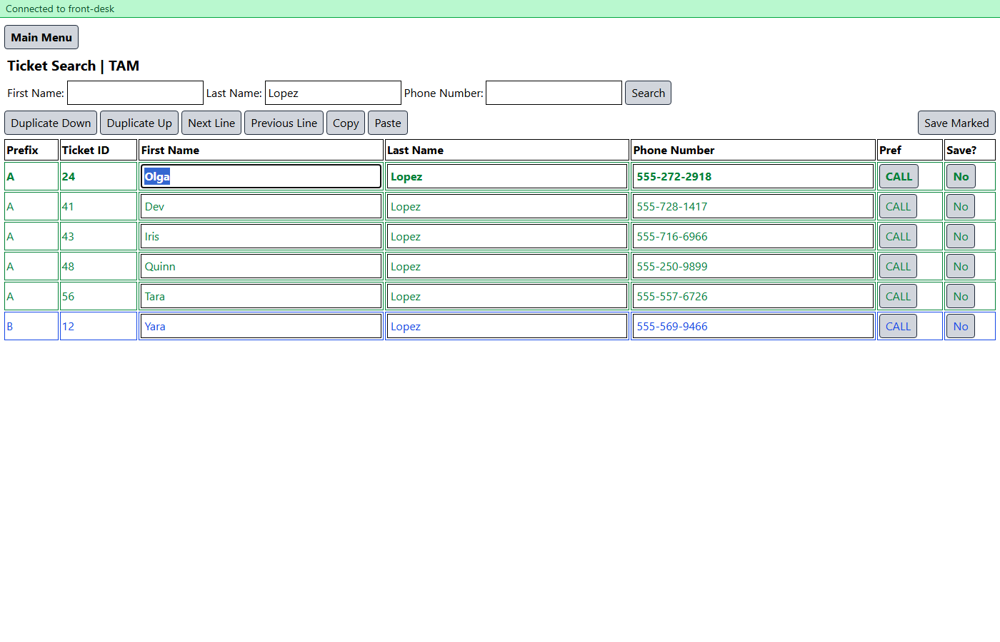

The server went away: the pages keep working from the computer's own copy, and the save waits for the server to come back:

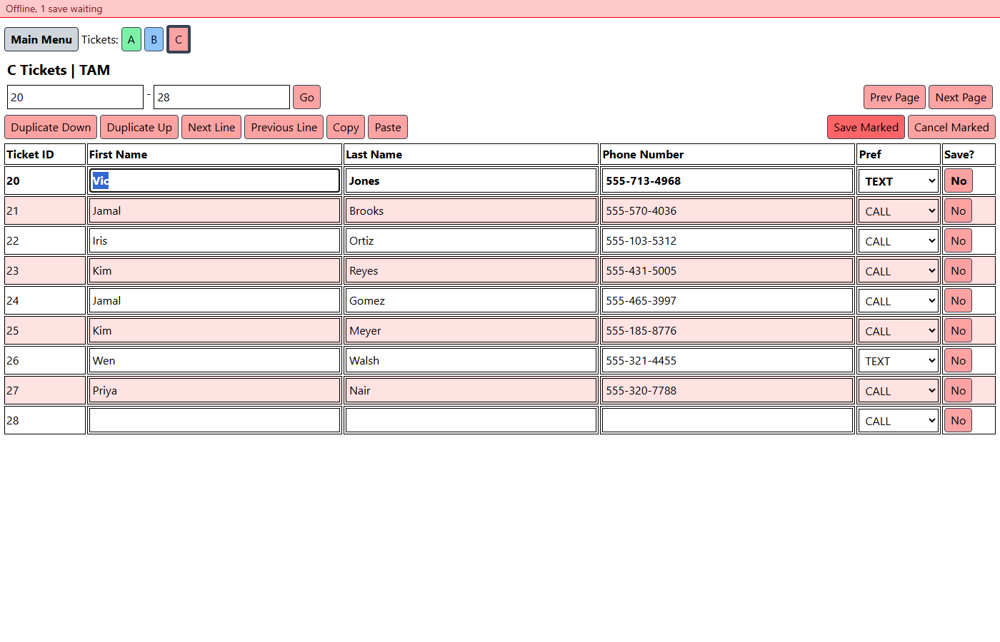

Settings on a computer that has not paired yet, with the server it found on the network, and on one that has:

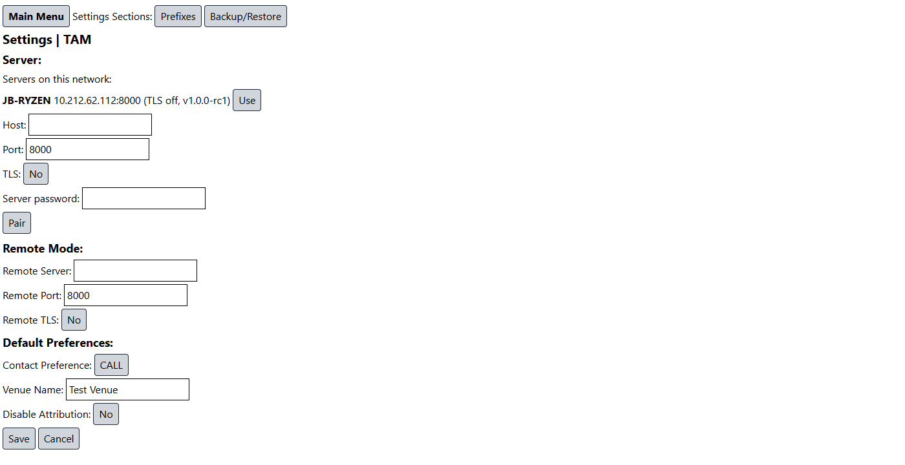

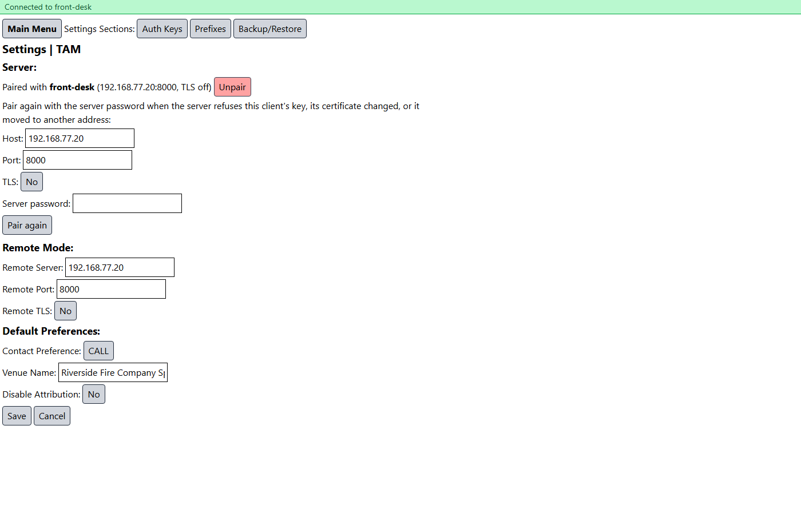

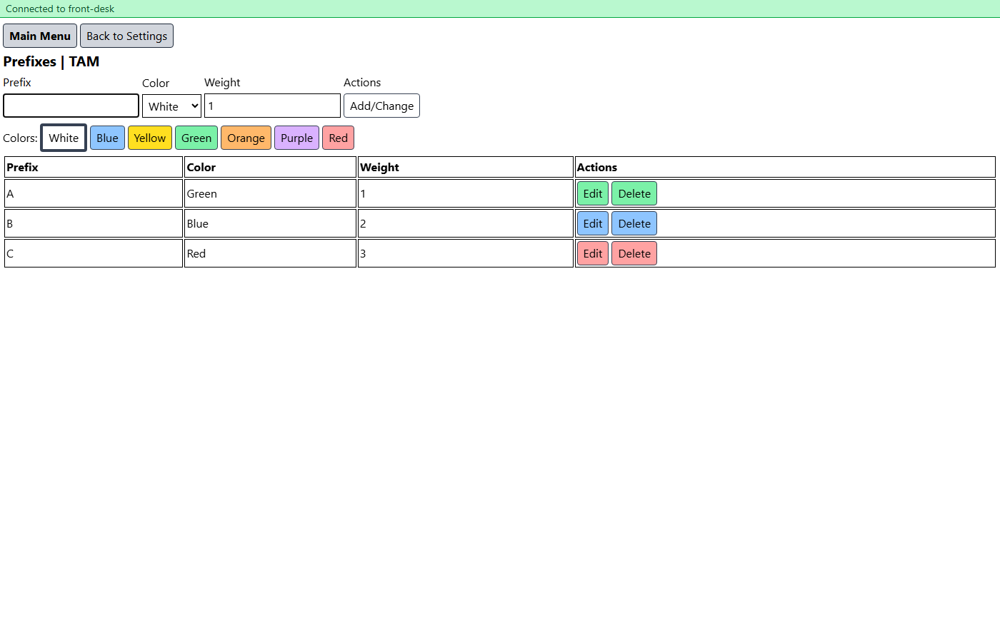

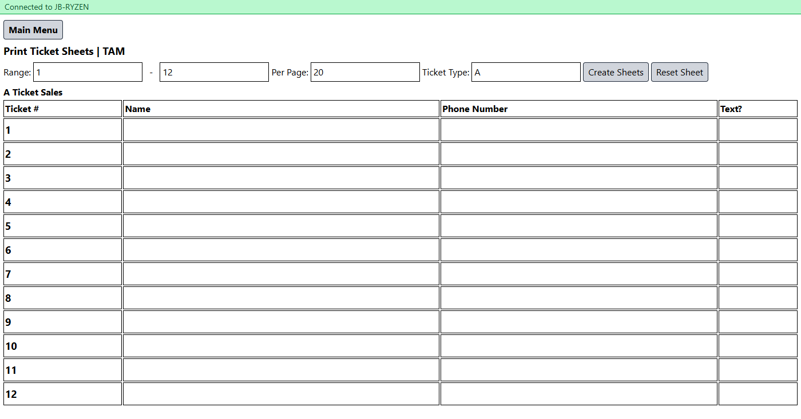

The server's admin page. The first visit sets the password; from then on the Status page shows every computer:

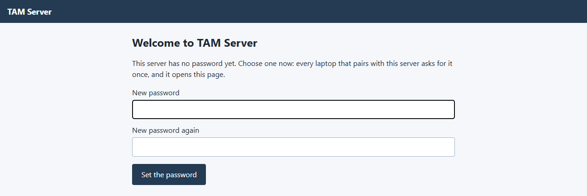

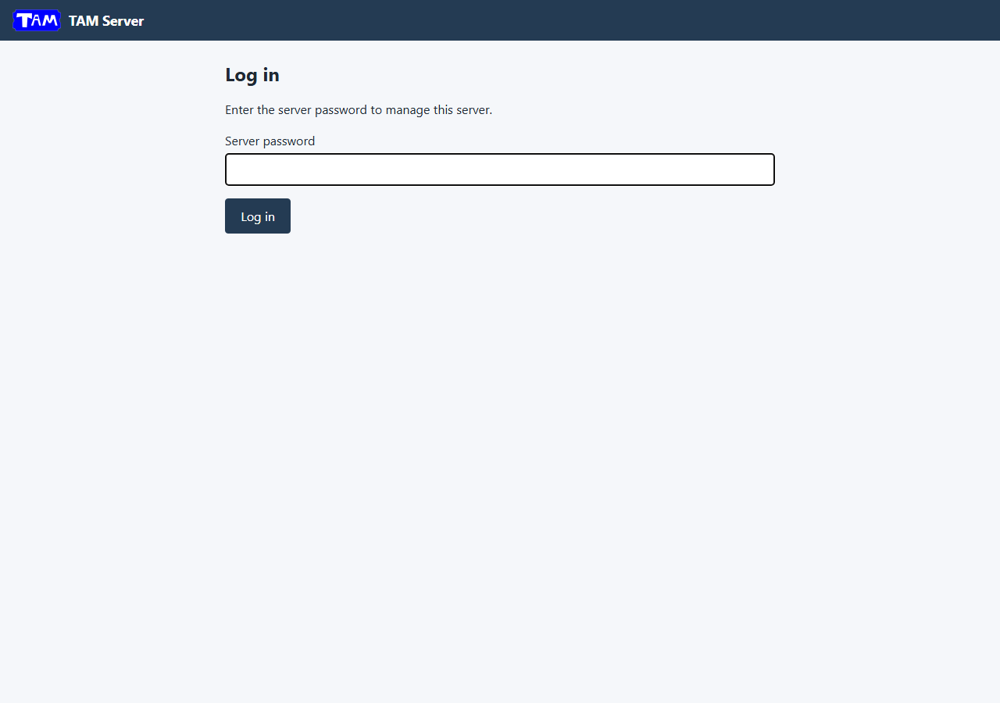

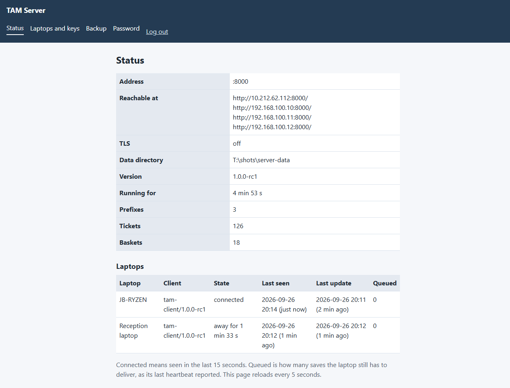

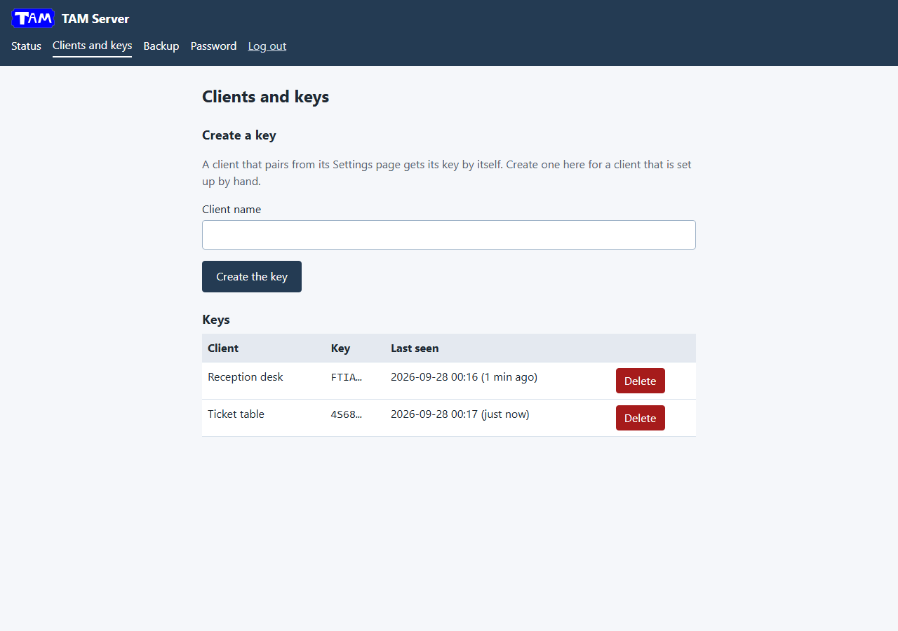

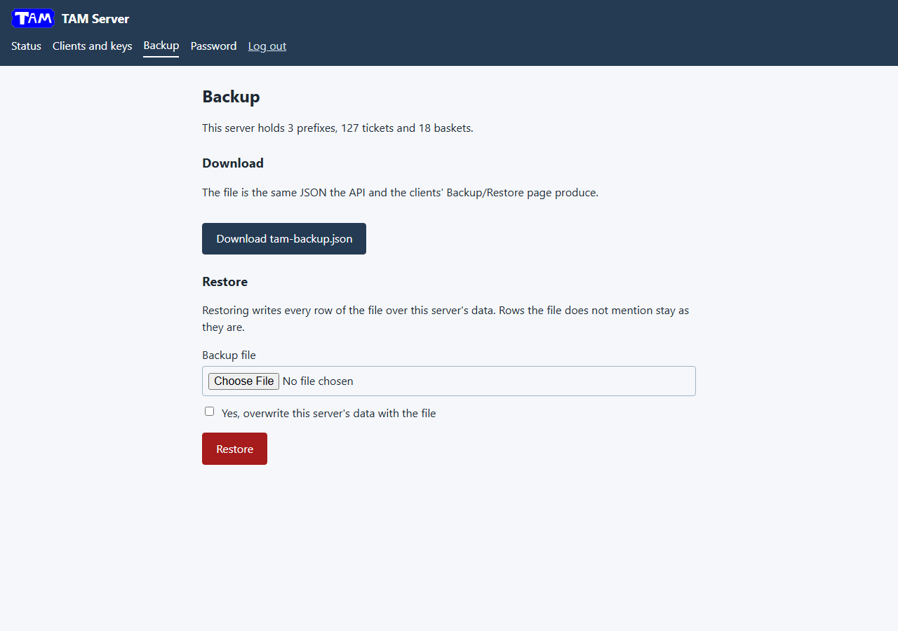

## Downloading

The [releases page](https://github.com/ticket-auction-manager/tam-go/releases) has one file per program and system. Take `tam-client` for a computer at the event and `tam-server` for the machine that hosts the server:

- **Windows**: `tam-client-<version>-windows-amd64.exe` or `tam-server-<version>-windows-amd64.exe` (`-windows-arm64` for a Snapdragon machine). Put it in a folder of its own and double-click it. The `.zip` of the same name adds this README. The programs are not signed, so SmartScreen asks once: More info, then Run anyway.
- **Debian, Ubuntu, Mint and their relatives**: the `.deb` of the program (`sudo apt install ./tam-server_<version>_amd64.deb`).
- **Fedora, RHEL, Rocky, Alma and their relatives**: the `.rpm` of the program (`sudo dnf install ./tam-server-<version>.x86_64.rpm`).
- **Any other Linux**: the `-linux-amd64.tar.gz` (or `-linux-arm64`) of the program, with an installer script for systemd; run `chmod +x` on the program if your unzip tool dropped the executable bit.
- **macOS**: the `-darwin-arm64.tar.gz` (Apple silicon) or `-darwin-amd64.tar.gz` (Intel) of the program, with a launchd file; clear the quarantine flag once with `xattr -dr com.apple.quarantine tam-client` (or `tam-server`).
- **NixOS**: nothing to download; the flake in this repository builds both programs and has a NixOS module for them (see NixOS under [Deployment](#deployment)).

Then, on the server's machine, open `http://<that machine>:8000/admin` and set the server password. On each other computer start the client, press Alt(option)+A, open Settings, pick the server from the list, enter the password once and press Pair. See [Deployment](#deployment) for the details per system.

## Cloning the repo

To clone the repo you just need to run the git clone command to clone it to a directory of your choosing. Replace 'yourrepofolder' at the end with the folder/dir of your choosing.

Github:

`git clone https://www.github.com/Ticket-Auction-Manager/tam-go yourrepofolder`

## Installing dependencies

Server and client:

(needs Go 1.27 or newer installed)

Nothing to install: `go build` fetches the Go modules.

Client web pages:

(needs pnpm installed)

```
cd frontend
pnpm install
```

## Building

```
./build.sh client       # the web pages, then tam-client into build/
./build.sh server       # tam-server into build/
./build.sh all          # both
./build.sh release      # every system: build/<os>-<arch>/ and one archive per program and target
```

With Nix, `nix build` builds both programs into `result/bin` (see NixOS under [Deployment](#deployment)).

`./build.sh release` builds the web pages once, then both programs for Windows, Linux and macOS on amd64 and arm64 (`CGO_ENABLED=0`, `-trimpath`, `-ldflags "-s -w"`) into `build/<os>-<arch>/`, and packs each program of each target into `build/tam-server-<version>-<os>-<arch>.zip` and `build/tam-client-<version>-<os>-<arch>.zip` (Windows, where the bare program is also copied to `build/tam-server-<version>-windows-<arch>.exe` and `build/tam-client-<version>-windows-<arch>.exe`) or `.tar.gz` (Linux, macOS): one folder with that program, `README.md`, `LICENSE.md` and its files from `deploy/linux` or `deploy/macos` (its unit and `install.sh`, plus the application-menu entry for the client; its launchd file and the macOS notes as `INSTALL.md`). For Linux it also writes a `.deb` and an `.rpm` of each program with [nfpm](https://nfpm.goreleaser.com), from `deploy/linux/nfpm`, which `build.sh` installs with `go install` when it is not on the PATH. The version stamped into both programs, `internal/version.Version`, is `$VERSION` when set and otherwise `git describe --tags --always --dirty`; both programs print it in their banner and the server reports it on `GET /api` and its admin page. `SKIP_WEB=1` keeps an existing `cmd/tam-client/dist`. A tag `1.2.3` (or `v1.2.3`) becomes version 1.2.3 everywhere: the programs' banners and `GET /api`, the admin page, the Windows file properties, the `.deb` and `.rpm` versions and every file name; a tag `1.2.3-rc1` is a pre-release, marked so on GitHub and sorted before 1.2.3 by apt and dnf. To cut a release: `git tag -a 1.2.3 -m "1.2.3"` on the commit, then `git push origin 1.2.3`. The archives are written with `zip` and `tar` where those exist and with Python otherwise. Both Windows builds carry the TAM icons and version information from the `rsrc_windows_*.syso` files, which `go generate ./cmd/...` makes with [go-winres](https://github.com/tc-hib/go-winres) from `cmd/*/winres/winres.json`; a release build remakes them with the release version first and puts the committed files back afterwards.

Releases come from `.github/workflows/release.yml`: pushing a version tag runs `VERSION=<tag> ./build.sh release` on GitHub and attaches the twelve archives (two programs, six targets), the four bare Windows programs and the eight Linux packages to a GitHub release of that tag. The release's description is `docs/release-notes.md` with the version filled in (what to download for which machine, the first start, upgrading, switching from the original), followed by the list of changes GitHub generates. `ci.yml` vets, tests and cross-compiles all six targets on every push, runs the compatibility check against the original, runs the unit tests and a load test with the race detector, and builds the Nix package and runs its NixOS test.

## Running dev instances

Server:

```
go run ./cmd/tam-server -addr 127.0.0.1:8000
```

Client, with the web pages served live by Vite (they proxy `/api` to the client program):

```
go run ./cmd/tam-client -addr 127.0.0.1:3080 -open=false
cd frontend
pnpm dev
```

Or build the pages once (`./build.sh client`) and run `build/tam-client`, which serves them itself and opens the browser.

## Running the tests

The tests need Go and the built web app (`pnpm build` in `frontend/`, as for any build). CI runs all of them on every push and keeps what they print: each run's page on GitHub (Actions) shows the unit tests, the compatibility run, the tests with the race detector, the load test's report and the NixOS test, and has them as files to download under Artifacts. [docs/test-results.md](docs/test-results.md) has the printed results of the longer runs, made on a real machine.

Unit and integration tests; the client tests drive the real server handler as their server:

```
go test ./...
```

The compatibility run against the original tam, its FastAPI server at a pinned commit and its SvelteKit client next to the Go programs (needs Python 3, Node with pnpm, git and curl):

```
bash scripts/compat/run.sh
```

The load test runs a whole event through one real `tam-server` and many real `tam-client` programs on the machine, each client with its own data folder and paired through its Settings route. Ticket entry is paced over 40 seconds, fixing a typo now and then and opening sheets again; a quarter of the way in the server is killed and started again 8 seconds later while the clients keep saving, and each client goes back to correct the sheets it saved meanwhile as soon as it sees the server again. Then another client corrects every 40th ticket, the baskets are entered and drawn (each winner looked up as the page does), every report and a few searches are read, and for 10 seconds every client saves as fast as it can. It then checks every ticket, basket and winner on the server and in each client's own copy, the admin page's Clients table, and everything the programs wrote, and prints the time of every page action:

```
go run ./scripts/loadtest
go run ./scripts/loadtest -clients 50 -tickets 9000 -baskets 1000
go run ./scripts/loadtest -h
```

Along the way, every client reaches the server through a relay of its own, its Wi-Fi: a quarter of them lose it silently for 12 seconds between opening a sheet and saving it (the relay holds what was sent and delivers it up to 10 seconds after the link is back, as TCP retransmissions do, so a save the client gave up on can arrive after its replay), and the volunteer types a row again after a save that hung. Two clients crash while the server is down and start again with their queue. An admin deletes a client's key and the volunteer pairs again. Then every client saves the same ten tickets at once for five seconds. The checks include that every save reaches the server in the order it was made, that nothing queued is lost, that tickets saved by everyone end whole and read the same on every client, and that no page waited more than six seconds. `-tls` runs it all over HTTPS; `-h` lists the knobs.

It exits with status 1 when a check fails and then keeps the data folders and logs for a look. `-out <file>` also writes everything it prints to that file, a report to share (with `-server` it names that server's address). `-bin <folder>` tests programs built elsewhere, such as a release or a build with `-race`.

To test over a real network, start `tam-server` on another machine with an empty data folder and a password, and point the clients at it; `-kill` and `-restart` take the commands that kill that server and start it again (through ssh, for example) for the outage, and without them the run has no outage:

```
go run ./scripts/loadtest -server http://<that machine>:8000 -password <its password> -clients 100
```

With Nix, the package and the NixOS module have their own check: it builds the package, which runs the unit tests in the build sandbox, and starts three NixOS machines (it needs KVM). A client finds the server by its announcement, pairs with it, saves a prefix and a ticket, and the ticket is on the server, also after both services restart; a second server serves HTTPS with a certificate of its own; and Shut Down TAM stops the client's service until it is started again:

```
nix flake check -L
```

## Configuration

| Setting | Where | Default |
|---|---|---|
| `TAM_DATA_DIR` | environment, both daemons | `./data` |
| `TAM_PWD` | environment, tam-server | `changeme` (a warning is logged; set it before exposing the server) |
| `-addr` | flag, both daemons | `localhost:3080` for the client, `:8000` for the server (`:8443` with `-tls`) |
| `-open` | flag, tam-client | `true`: open the web app in the default browser on start |
| `-tray` | flag, both daemons | `true` on Windows: a TAM icon in the notification area with Open (client) and Shut Down entries; use `-tray=false` for services and scripts. Other systems have no icon and stop on Ctrl+C or SIGTERM |
| `-announce` | flag, tam-server | `true`: announce the server on the local network (mDNS) so clients can find it in Settings |
| `dev` | positional argument, tam-server | binds localhost instead of every interface |
| `-tls`, `-cert`, `-key` | flags, tam-server | HTTPS with the given PEM files, or a self-signed pair created in the data directory |

`tam-client` keeps `settings.json` in the data directory. It is safe to edit by hand while the daemon runs; the edit is picked up on the next request. A file that fails to parse is logged and the last good settings stay in effect until it is fixed or saved again from the Settings page. Both programs also append everything they print to `tam-client.log` or `tam-server.log` in the data directory, including why they stopped (Ctrl+C, a closed window, the Shut Down button, or the notification-area icon), so the reason is there after the window is gone.

The databases use SQLite's WAL journal, so recent writes may sit in `tam-local.db-wal` next to the main file: copy the whole data folder, or stop the daemon first, when taking a copy by hand. Backup/Restore in the app is the safer route.

A data folder from the original app is a drop-in: the tables and views are the same, and the Go daemons open it as is.

```json
{
  "remote_server": "",
  "remote_key": "",
  "remote_port": "8000",
  "remote_tls": false,
  "default_pref": "CALL",
  "venue_name": "Test Venue",
  "disable_attrib": false
}
```

## Remote mode

Remote mode is for events with several clients: one `tam-server` holds the data and every client works against it. It is built for clients that move around and lose wifi: a save never waits for a dead connection and is never lost.

1. Run `tam-server` on the machine that stays put, where every client can reach it. On first start it has no password: open `http://<that machine>:8000/admin` and set one (or start it with `TAM_PWD` set, as the original was). For HTTPS start it with `-tls`: it listens on port 8443 and writes a self-signed certificate (`server.crt`, `server.key`) into its data directory on first start; put your own PEM files there, or point `-cert` and `-key` at them, to use a real certificate. Windows asks once whether to allow the program through the firewall. To stop it, right-click its icon in the notification area and choose **Shut Down TAM Server**, close its console window, or press Ctrl+C in it; the clients' **Shut Down TAM** button only stops the client it is pressed on.
2. On each client press `Alt+A`, open Settings and look at the **Server** section. Servers on the venue network appear there by name: they announce themselves (mDNS, `_tam._tcp`), and because some access points drop multicast, the client also asks the standard ports (8000, and 8443 for TLS) on every address of its own /24 networks, which takes a second or two and finds the server wherever plain traffic gets through. Interfaces that only lead to containers or VMs on the client computer itself (Docker, WSL and the like) are left out, and a server seen at several addresses is listed once, at the address the client shares a network with. A server on another port or another subnet is typed in by hand; its admin status page and its start-up banner list the addresses to type. Pick one, enter the server password once and press **Pair**. The client creates its own access key on the server, named after the computer it runs on, and over TLS it pins the server's certificate. **Unpair** returns the client to standalone mode with its local data intact. The original way still works too: the remote fields and the Auth Keys page are still there.
3. A bar on every page then shows where the client stands: green **Connected to <server>**, amber **Reconnecting** or red **Offline** with the number of saves waiting, or red when the server rejected this client's key. The main menu footer keeps the original's three lines.

What happens with the connection:

- **Reads** come from the server while it answers and nothing saved on this client is still waiting to reach it, and are copied into the client's own database on the way. Otherwise the pages read that copy, so the forms, reports and search keep working, and a sheet saved while the server was away shows what was saved until the server has it too. On pairing and every time the connection comes back, the client pulls the server's whole data set into its copy (0.25 s at 9,000 tickets) so a client that goes offline later has everything; rows the client saves while that download is on its way keep what was saved.
- **Saves** go to the server first, with a five-second limit. When the server does not answer (or answers 5xx), or this client still has saves waiting for it, the rows are stored on the client and queued in an outbox behind the ones already there, so the server takes a client's saves in the order they were made; the page gets its normal answer plus an `X-TAM-Queued: 1` header. A background worker pings the server every five seconds, replays the outbox in order as soon as it answers, and then pulls the data set again. A save the server rejects as bad data (a 4xx) is not queued: the error goes back to the page. A save the server refuses because the key is wrong stays queued, the bar says so, and pairing again with the same server (at its old address, or by its name at a new one) sends it. Pairing with another server, or unpairing, sets the saves still queued aside in the failed list rather than sending them anywhere by themselves.
- **Conflicts** are settled by arrival at the server: the last save wins, as in the original. A client replaying an old edit after another client changed the same ticket wins with the older edit. Within one client, its saves apply in the order it made them: when the Wi-Fi drops in the middle of a save, the network may still deliver that request seconds after the client gave up on it and sent it again, and the server skips that late copy instead of letting it undo newer saves (see API).
- **Refused saves** (the server answered 4xx during a replay), and saves set aside when the client paired with another server or was unpaired, are kept in a failed list, counted in the bar, and can be retried (sent to the server the client is paired with now) or discarded from Settings. Nothing queued is ever dropped without a Discard.

Backup/Restore can still push the local prefixes, tickets or baskets to the server and download the server's data; those two actions are direct and report failure instead of queueing.

### Server admin page

`tam-server` serves its own pages under `/admin`, protected by the server password: status, keys (create and delete), backup download and restore, and a password change. The password hash lives in `server.json` in the data directory and wins over `TAM_PWD`; with neither set the server starts in setup mode, logs the address to open, and refuses to hand out keys until a password exists.

The status page shows the address, TLS, data directory, version, uptime and counts, then a **Clients** table with one row per key: the client's name, the program it runs (**Program**), its **State**, when it was last seen, when it last saved anything (**Last update**) and how many saves it still has queued (**Queued**). A client is `connected` when the server heard from it in the last 15 seconds (the client pings every 5), `away for` some time otherwise, and `never` when its key has not been used yet. The page reloads every 5 seconds, so an admin can watch every client come back and its queue drain to 0 before packing up; `GET /admin/status` with `Accept: application/json` answers the same table as JSON (`uptime`, `prefixes`, `tickets`, `baskets`, and `clients` with `name`, `program`, `state`, `last_seen`, `last_update` and `queued`) for a logged-in session and a 401 without one, for scripts.

Two optional headers feed the table. `X-TAM-Client: tam-client/<version>`, which `tam-client` sends with every request, names the program; without it the server shows the first word of the `User-Agent`. `X-TAM-Pending: <n>` on the heartbeat (`GET /api` with the key, every 5 seconds) is the number of saves queued on that client; a client that never sends it shows `–` under Queued. The original client sends neither, so it is listed under its `User-Agent` and follows the same 15-second rule. Last seen and last update are also kept in the database (`auth_keys.last_seen` and `auth_keys.last_update`, written at most once a minute) and reported by `GET /api/auth`, so they survive a restart; the live values win while the server runs.

### Compatibility with the original

The API is the original's, so the original `tam-client` (Linux/Docker) and the Go client can share one server, and either server works. `scripts/compat/run.sh` proves it: it starts the original FastAPI server at a pinned commit and runs the Go client's `TestCompat*` tests against it, then starts the Go server with both the original SvelteKit client and the Go client and drives every route through each (`scripts/compat/drive.py`). CI runs it on every push. Two quirks of the original as published are handled on this side, so a mixed setup comes out right either way: its server leaves winning tickets alone on a restore, so `tam-client` sends them a second time through the drawing route after every restore or push into a server; and its client sends the key as `TAM_KEY` on its server-backup download, so `tam-server` accepts that spelling too. Fixes for the original itself, including its local restore skipping tickets that already exist, are submitted as [ticket-auction-manager/tam#1](https://github.com/ticket-auction-manager/tam/pull/1). The checks here are strict.

## Deployment

Both programs are single, self-contained executables: copy the one you need to the machine and run it. There is nothing to install and no container runtime is needed. The original's Caddy and portable-Node deployment files are not carried over, and the server's `-tls` flag replaces the reverse proxy; a Dockerfile and a compose file under `deploy/docker` are there for those who ran the original's containers, and on NixOS this repository's flake takes the place of `nixos/tam.nix`.

| Original | Here |
|---|---|
| `dbob16/tam-client` container on port 3000 | `tam-client` (or `tam-client.exe`) on port 3080 |
| `dbob16/tam-server` container plus a Caddy proxy on 8443 | `tam-server -tls` on 8443, or `tam-server` on 8000 |
| Data volume `/data` | the `data` folder next to the program, or `TAM_DATA_DIR` |
| `nixos/tam.nix`, a client running the client container | `services.tam-client` from this flake, and `services.tam-server` for the server |

**Windows.** Download `tam-client-<version>-windows-amd64.exe` on a client, or `tam-server-<version>-windows-amd64.exe` on the machine that hosts the server (`-arm64` for a Snapdragon machine), put it in a folder of its own and double-click it; the zip of the same name holds the same program with this README and the license. The program is not signed, so SmartScreen asks once: More info, then Run anyway. Each shows a TAM icon in the notification area while it runs (right-click it for Open and Shut Down) and keeps its console window; Windows asks once whether to allow the server through the firewall. To start one at logon, put a shortcut to it in the Startup folder (`shell:startup`), with `-open=false` if the browser should not open by itself. The executables carry the TAM icons and version information (right-click, Properties, Details); `go generate ./cmd/...` regenerates the resource files with [go-winres](https://github.com/tc-hib/go-winres) after changing `icon.ico` or `winres/winres.json`.

**Linux.** On Debian, Ubuntu and their relatives install the `.deb` of the program (`sudo apt install ./tam-server_<version>_amd64.deb`), on Fedora, RHEL and their relatives the `.rpm` (`sudo dnf install ./tam-server-<version>.x86_64.rpm`); the client's package is `tam-client`. Either puts the program in `/usr/bin` with its unit, creates the `tam` user, and starts the service at once (the same units as below, so the server listens on port 8000 and asks for its password on the first visit of the admin page); `apt remove` or `dnf remove` stops and removes it, keeping the data in `/var/lib/tam-server` or `/var/lib/tam-client` for a reinstall. For any other distribution, or without root, extract `tam-server-<version>-linux-amd64.tar.gz` or `tam-client-<version>-linux-amd64.tar.gz` (or `-arm64`) and run the program by hand (`./tam-client` opens the browser; Ctrl+C, SIGTERM or the Shut Down button stops either), or install it as a service: `sudo ./install.sh` in the extracted folder installs the program found next to it (`server`, `client` or `all` as the argument chooses explicitly, for example from a checkout's build folder), copies it to `/usr/local/bin`, creates a `tam` system user with the data folders `/var/lib/tam-server` and `/var/lib/tam-client`, puts the icons and an application-menu entry for the client under `/usr/local/share`, and installs, enables and starts the units `tam-server.service` (`-addr :8000`, for the whole network) and `tam-client.service` (`-addr :3080 -open=false`), the files in `deploy/linux`. The units run as `tam` with `ProtectSystem=strict`, so only the data folder is writable; `journalctl -u tam-server` has the log, and the program's own log file is in the data folder. The server's admin page at `http://<host>:8000/admin` asks you to set a password on the first visit unless `TAM_PWD` is set in the unit (a commented line is there for it). On a computer used by one person the client is better run by hand or from the menu entry, which keeps its data in `~/.local/share/tam-client`, than as a service; the script says so, and `sudo systemctl disable --now tam-client` turns the service off. The comment at the top of `install.sh` lists the commands that undo the installation. Without systemd, run the programs by hand.

**NixOS.** The repository is a flake. `nix build` builds both programs from source into `result/bin` (the web app with pnpm, then Go, running the unit tests on the way); `nix run github:ticket-auction-manager/tam-go` starts `tam-client`, `nix run github:ticket-auction-manager/tam-go#tam-server` the server, and `nix develop` gives Go, Node and pnpm. The version the programs report is the commit they were built from. Its NixOS module runs either program as a service under its own unprivileged user, with its data in `/var/lib/tam-server` or `/var/lib/tam-client` and its log in the journal (`journalctl -u tam-client`). In a flake-based configuration, a client computer:

```nix
{
  inputs.tam-go.url = "github:ticket-auction-manager/tam-go";

  outputs = { nixpkgs, tam-go, ... }: {
    nixosConfigurations.client1 = nixpkgs.lib.nixosSystem {
      system = "x86_64-linux";
      modules = [
        ./configuration.nix
        tam-go.nixosModules.default
        {
          services.tam-client.enable = true;              # the web app on http://localhost:3080/
          services.tam-client.openBrowserAtLogin = true;  # opened at login: with automatic login, a kiosk
          services.tam-client.openFirewall = true;        # UDP 5353, to find the server by its announcement
        }
      ];
    };
  };
}
```

And the machine that holds the event's data:

```nix
services.tam-server = {
  enable = true;
  openFirewall = true;                           # TCP 8000 (8443 with tls), and UDP 5353 for the announcement
  # tls = true;                                  # HTTPS with a self-signed certificate, or certFile and keyFile
  # passwordFile = "/run/secrets/tam-password";  # otherwise the password is set on the first visit of /admin
};
```

A configuration without flakes can import the module from a pinned commit, with flakes enabled in `nix.settings.experimental-features`:

```nix
imports = [ (builtins.getFlake "github:ticket-auction-manager/tam-go/<commit>").nixosModules.default ];
```

Compared with `nixos/tam.nix`, the client runs `tam-client` natively instead of the Docker image, finds and pairs with the server from its Settings page instead of a `tam.lan` hosts entry, and keeps the automatic login in its own configuration (`services.displayManager.autoLogin`). Shut Down TAM in the web app stops the service until the next boot or `systemctl start tam-client`. The programs in the Linux archives are static, so they also run by hand on NixOS; `install.sh` stops there, since NixOS keeps `/etc` and the units in its configuration. The flake pins its nixpkgs, because the build needs Go 1.27, which NixOS 26.05 does not have; a machine on a stable release runs the same build. When `go.sum` or `frontend/pnpm-lock.yaml` changes, `nix/package.nix` needs the new `vendorHash` or pnpm `hash`: set it to `lib.fakeHash`, run `nix build`, and copy the hash Nix reports. CI's Nix job fails until then.

**macOS.** Extract `tam-server-<version>-darwin-arm64.tar.gz` or `tam-client-<version>-darwin-arm64.tar.gz` (Apple silicon; `-darwin-amd64` for Intel). The programs are not signed, so clear the quarantine flag once (`xattr -dr com.apple.quarantine tam-client` or `tam-server`) and make sure the program is executable (`chmod +x`), then run it by hand, or start it at login with the launchd agents `com.ticket-auction-manager.tam-server.plist` and `com.ticket-auction-manager.tam-client.plist` from `deploy/macos` (`INSTALL.md` in the archive has the `launchctl bootstrap` and `bootout` commands). The agents keep the data under `~/Library/Application Support/tam-server` and `~/Library/Application Support/tam-client` and restart a program after a crash. There is no notification-area icon on macOS.

**Docker.** `deploy/docker/Dockerfile` builds either program from source (`--build-arg PROGRAM=tam-client` for the client) into a small Alpine image with the data in `/data`, and `deploy/docker/compose.yml` runs the server on port 8000 with `./data` mounted, like the original's compose file: `cd deploy/docker && TAM_PWD=secret docker compose up -d --build`. The client is under the `client` profile (`docker compose --profile client up -d --build`: port 3080, `./client-data`); pair it with host `tam-server` and port 8000 inside the compose network. A Docker whose buildx plugin is older than 0.17 (Unraid ships one) makes `docker compose` refuse to build; there, build the image from the repository root with `docker build -f deploy/docker/Dockerfile -t tam-server .` and start it with `docker compose up -d` without `--build`. A Docker without the plugin at all builds either way. Announcements on the local network do not leave a bridged container, so the compose file starts the server with `-announce=false` and the clients type the address; `network_mode: host` brings the announcement back.

## Switching from the original

The Go programs read the original's data as it is: `tam-remote.db` for the server, `tam-local.db` and `settings.json` for the client, with the same tables and views. Point `TAM_DATA_DIR` at the old data folder (or the folder behind the original's Docker volume, the `/data` of its containers), or copy those files into the `data` folder next to the program, and start it. The schema additions the Go programs need (the server's `auth_keys.last_seen` column, the client's outbox tables) are applied on the first start; they are additions only, so the original can still open the folder afterwards. `internal/db/compat_test.go` proves both original schemas open and migrate. Existing access keys keep working, and the original's client can keep talking to the Go server (see Compatibility with the original).

With the original's compose file the server was `dbob16/tam-server` on port 8000 with a `/data` volume, and the client `dbob16/tam-client` on port 3000, with a Caddy proxy on 8443 for HTTPS. `deploy/docker/compose.yml` keeps the server on `8000:8000` with `./data:/data`: move the contents of the old volume into `./data`, or name the old volume in its place, and `docker compose up -d`. The client moves from port 3000 to 3080 (`3080:3080`). The Caddy proxy is gone: `tam-server -tls` serves HTTPS itself on 8443, with a self-signed certificate created in the data folder on the first start or with your own PEM files through `-cert` and `-key`; it is the same flag on Windows, Linux and macOS, with no container involved.

## API

Both daemons answer JSON with the original's field names and `{"detail": "..."}` on errors. The server requires a `TAM-KEY` header on every data route and a `TAM-PW` header on key management.

| Route | Server | Client |
|---|---|---|
| `GET /api` | who am I, authenticated, healthy | who am I; in remote mode the server's answer |
| `GET/POST /api/settings` | | read, or merge a full or partial object |
| `GET/POST/DELETE /api/auth` | list, create `{description}`, delete `?key_to_del=` (password) | proxied with the page's `TAM-PWD` header |
| `GET/POST/DELETE /api/prefixes` | list, upsert, delete `?p=` | same; DELETE answers 404 when nothing matched |
| `GET /api/tickets[/{prefix}[/{id}|/{from}/{to}]]`, `POST /api/tickets` | rows; single and range answer lists | single answers one object or a placeholder; range answers every id with placeholders, capped at 300 |
| `GET /api/baskets…`, `POST /api/baskets` | same shape | same shape |
| `GET /api/drawing…`, `POST /api/drawing` | baskets joined with winners; POST sets winning tickets | same |
| `GET /api/reports/byname/{prefix}`, `/bybasket/{prefix}`, `/counts` | report rows | same |
| `GET /api/search/tickets?first_name&last_name&phone_number`, `POST` | substring search, upsert | same |
| `GET/POST /api/backuprestore` | export, import | `/local`, `/remote`, and `POST /push/{prefixes\|tickets\|baskets}` |
| `GET /api/status` | | `{"mode":"standalone"}` or mode, state (`connected`, `reconnecting`, `offline`, `unauthenticated`), server, server_name, pending, failed, last_ok |
| `GET /api/servers` | | servers announcing themselves on the network: name, host, port, tls, version |
| `POST /api/pair`, `POST /api/unpair` | | `{host, port, tls, password}` pairs and stores the key; unpair takes an optional `{password}` to delete the key on the server |
| `POST /api/outbox/retry`, `POST /api/outbox/discard` | | the failed list back into the queue, or dropped |
| `/admin/...` | login, status, keys, backup, password (HTML) | |

Writes to the client require `Content-Type: application/json`, and a browser request from another site (`Sec-Fetch-Site: cross-site`) is refused, which replaces the original's per-process client id header.

`tam-client` names and numbers the saves it sends to the server: `X-TAM-Client-Name` is the client's name (made once and kept with its data; a data folder copied to another machine makes a new one) and `X-TAM-Save` a number that only grows. `tam-server` applies a numbered save only when it is newer than the last one it applied from that client, and answers an older one, or a repeat, `200` with `X-TAM-Stale: 1` without applying it, so a request the network delivers late cannot undo newer saves. Saves without the headers, as the original client sends them, apply as they come, and the original server ignores the headers.

## Differences from the original

- Every handler validates before writing and returns after an error; a rejected batch writes nothing.
- Settings saves merge onto the current file and are validated; a malformed file no longer breaks every request.
- Prefix deletion encodes the name (`A&B`, `50%`, `C+` can be deleted) and reports 404 when nothing matched.
- Restore overwrites existing rows on both daemons (the original overwrote locally but skipped existing tickets, and never updated winning tickets on the server).
- The remote backup download sends the correct `TAM-KEY` header, the single-basket lookup calls the baskets endpoint, and the by-basket report is titled by basket.
- Access keys are generated with a cryptographic random source; the server never accepts an empty key.
- The number input for prefix weight only accepts non-negative integers; prefix names are trimmed, at most 100 characters, may not contain `/` or `\` and may not be `.` or `..` (they appear in URLs).
- Ticket search treats `%` and `_` typed by the user as literal characters instead of SQL wildcards.
- A backup written by the original app restores even if a prefix carries a colour outside the palette (it is shown as white) or a name the prefix form would refuse today (`A/B`, a name with spaces around it): restores and a client copying its server's data take the rows as they are, so no prefix is cut off from its tickets. The contact preference stays free text as in the original.
- The Settings page refuses a remote server entered with a scheme or a path (`http://tam.lan`, `tam.lan/api`): enter the host name or address only.
- Every link is a full page load (`data-sveltekit-reload`, as in the original), so pending rows on the forms are saved when you leave the page and each prefix starts with a clean form.
- The client listens on port 3080 instead of the original's 3000.
- Both programs run as plain desktop programs rather than containers: on Windows they show a TAM icon in the notification area with Shut Down (and, for the client, Open) entries, the client opens the browser on start and has a **Shut Down TAM** button under `Alt+A`, and Ctrl+C or a closed console window stops either one cleanly.
- Request bodies are capped at 64 MiB (the original ran Node with no limit); that is far above any realistic backup file. A larger body answers 413.
- Validation errors answer 400 where FastAPI answered 422. Unknown paths and wrong methods under `/api` answer `{"detail": ...}` as the original did. `HEAD` is accepted on every GET route.
- `DELETE /api/prefixes` and `DELETE /api/auth` echo the deleted row; a missing row is 404. In remote mode a prefix the server no longer has is still removed from the local mirror.
- Success messages use the `message` key everywhere (the original used `details` for a local restore and an empty list for a remote one). A reversed range (`/5/1`) is swapped instead of answered empty.
- Ids accept every spelling the original accepted (`4`, `4.0`, `"4"`); a ticket or basket without an id is rejected instead of being stored as id 0.
- Both daemons require `Content-Type: application/json` on POST (the original client always sent it; the original server did not check). The push buttons send an empty JSON object for the same reason.
- 500 and 502 responses carry a generic message; the reason is in the daemon's log.
- `tam-server dev` binds localhost only when `-addr` is not given.
- The counts report labels its last row `Total` on both daemons (the original server said `Totals`); the report views are recreated on every start so an older database picks that up.

## Layout

```
cmd/tam-client, cmd/tam-server   entry points
internal/env                     data directory from TAM_DATA_DIR, log file
internal/db                      SQLite open + schema (tables and views of the original)
internal/store                   every query, typed models
internal/config                  settings.json
internal/httpx                   JSON helpers, request guards
internal/remote                  HTTP client for tam-server
internal/server                  tam-server API
internal/client                  tam-client API and web app serving
internal/desktop                 browser opening, console title, Ctrl+C handling, Windows notification-area icon
internal/sync                    connection state, heartbeat, outbox replay, mirror pull (remote mode)
internal/discovery               mDNS announce (server), browse and subnet sweep (client)
internal/presence                what the server last saw of each client, for the admin page
internal/admin                   the server's login-protected admin pages and password file
internal/version                 the version both programs report, stamped at build time
scripts/compat                   the compatibility run against the original tam
scripts/loadtest                 the load test: a whole event through one server and many clients
flake.nix, nix/                  the Nix package, the NixOS module for both services and its NixOS test
deploy/linux, deploy/macos, deploy/docker   systemd units, installer and .deb/.rpm definitions (nfpm/), launchd agents, Dockerfile and compose
frontend/                        SvelteKit single-page app (built into cmd/tam-client/dist)
```

## License

MIT, see [LICENSE.md](LICENSE.md).

## Verified

On 2026-09-25, on Windows 11 with Go 1.27.1 and pnpm 12:

- `go vet`, `gofmt -l` and `go test ./...` are clean. The client tests drive the real server handler as the remote, so the proxy contract is tested end to end.
- Standalone, through the browser: adding prefixes, selecting a prefix on the main menu, loading a ticket range and saving names, saving basket descriptions, entering a winning ticket with the buyer looked up live, winners by name, winners by basket, ticket counts, ticket search, print sheets, saving settings.
- Remote mode, through the browser: pointing the client at `tam-server dev` with `TAM_PWD=testpw`; the main menu shows Remote, Authenticated and Healthy; a wrong password on Auth Keys is rejected; creating a key and pressing Use; pushing prefixes, tickets and baskets; entering tickets against the server (confirmed on the server with curl and the key); remote backup download.
- Remote mode over HTTPS: `tam-server -tls dev` creating its certificate on first start, and the client with Remote TLS on and port 8443 reporting Authenticated and Healthy.

A second, adversarial pass then reviewed the package against the original with the original FastAPI server and the original SvelteKit client running as oracles, sending identical request suites to both implementations, and mixed the daemons (Go client against the original server, original client against the Go server). It found and led to fixes for: full page loads on navigation (the original's `data-sveltekit-reload`, without which pending rows were lost when leaving a form), a push that the original server rejected because unused lists were sent as `null`, a new connection pool per proxied request, a settings save that could be read half-written, numeric ids sent as strings by the original client, executable bits lost in the zip, and the smaller wire and documentation differences listed above. Attacks that held up: SQL injection through every parameter, path traversal on the web app, cross-site writes, oversized and malformed bodies, hundreds of concurrent and same-row writes, key deletion and server outage in remote mode.

Remote mode v2 (2026-09-26, Windows 11): `scripts/compat/run.sh` passed locally, the Go client against the original FastAPI server (commit `19eab77`) and the original SvelteKit client together with the Go client against `tam-server`, 25 cross-checks in `drive.py`. Live, with the built executables: the server's first start in setup mode and its password set from the admin page; the client finding the server by name on the network, pairing with the password, and the bar reading Connected; the server closed from its window, the bar turning Reconnecting within five seconds and Offline after thirty, a ticket saved meanwhile answered with `X-TAM-Queued` and shown on the tickets page from the client's copy; the server started again, the bar back to Connected within five seconds and the queued ticket present on the server. Size checked at 9,000 tickets and 400 baskets: every call about 0.2 s, the localhost floor on Windows.

All systems (2026-09-26, branch `all-systems`): `./build.sh release` built the six targets and their archives on Windows. The Linux archive then ran on two real machines. On an Unraid NAS (a Docker host, Linux 6.6, no systemd) `tam-server` started from the tarball, listed only the LAN address, announced itself, and a Windows client on the same network found it by itself, paired, and synced a ticket; its admin page showed that client as connected with nothing queued, then its last update after a save, then "away for 20 s" once the client had stopped. On an Ubuntu 24.04 server `sudo ./install.sh all` created the `tam` user and both systemd services, the server's password was set on the first visit of its admin page, the Linux client on that machine and a Windows client both appeared on the Clients table as connected with their version, a save from Windows showed as its last update and the Linux client read it back through the same server; `systemd-analyze verify` accepted both units. The Docker image built and answered on the Ubuntu server (`docker compose build` and `docker build`), on the Unraid host (`docker build`; its Compose wants a newer buildx plugin, as noted above) and on Docker Desktop; in WSL (Ubuntu 24.04) the installer, the units and both programs were exercised as well. Everything was removed from both machines afterwards. The unit suite and the compatibility run (24 checks) passed on the final commit. The macOS and arm64 builds were cross-compiled and packaged but not run. The archives were then split per program (`tam-server-...` and `tam-client-...`): on the Ubuntu server the server package and then the client package each installed itself as its service with `sudo ./install.sh` and no argument, with its icon and, for the client, the menu entry, and both Windows packages started here. The `.deb` pair then installed with `apt` on the Ubuntu server, both services active, and `apt remove` took them out leaving the data folders; the `.rpm` pair installed and removed with `dnf` in a Fedora 42 container.

Load test (2026-09-27, `scripts/loadtest`): its first runs found four problems, each now fixed and pinned by a test. A client that saw its server again while saves were still queued sent new saves straight to the server, so an older queued save of the same ticket could land after a newer one and win, and a sheet opened meanwhile showed the server's older rows; now a client works from its own copy and queues new saves behind the old ones until its queue is empty. The refresh after a reconnect could copy the server's older rows over saves made while it downloaded; now it leaves those rows alone, and waits until the queue has been sent. On a Linux server whose disk is slow to flush, 50 clients pairing at once made SQLite give up on a write (`database is locked`), because its busy wait is not first come, first served; now the writes of each program take turns. And the admin page could show a client's queue for up to a heartbeat after it had emptied; now the client sends a heartbeat as soon as its queue is sent.

Harder tests (2026-09-27): a review of the pairing code, the relay that drops a client's Wi-Fi silently and delivers late, crashes of clients with saves queued, and fuzz tests of every route found more, each fixed with a test that failed first. Pairing again, as the bar asks when the server refuses a client's key, dropped every save queued meanwhile; now the queue is sent, or set aside in the failed list when the client pairs with another server. A save queued offline was written to the client and to its queue in two transactions, so a client stopping in between kept a save it would never send; now both happen in one. A page reading from a server that went silent waited ten seconds; now four. A save the client gave up on while its Wi-Fi was gone could still reach the server seconds later, after its replay and after newer saves, and undo them; now the client numbers its saves and the server skips a late copy (see API). A range of ids ending at the largest number made the client allocate until it ran out of memory; search missed text after a NUL and failed on very long fragments; the prefix names `.` and `..` were accepted but unreachable; and one prefix name from the original that today's form refuses (`A/B`) made a restore, and every client's copy of its server's data, fail. With the fixes every run passes all its checks (26, or 36 with `-soak`), on Windows 11 (Ryzen 9 7900X3D, NVMe) with 20, 50 and 100 clients, over HTTPS, with the server down for 45 s, natively on the Ubuntu server, and with 100 clients on the Windows machine using the server on the Ubuntu machine over the LAN; the server logged every late copy it skipped (one per save that hung on a dropped link) and no error. A 45-minute soak with 25 clients and 9,000 tickets kept the server at 46 MB and about 470 open handles from the first rounds to the last, the clients at 68 MB falling to 54, and the write-ahead log at 4 MB. Throughput, with every save changing every row of its sheet (a save of unchanged rows writes nothing in SQLite, so the first figures here overstated it): 1,740 saves (43,500 rows) a second from 50 clients on the Windows machine, median 28 ms; on the Ubuntu server's SATA SSD, where each commit waits about 12 ms for the disk, 68 saves (1,700 rows) a second from 100 clients over the LAN. A real event saves a sheet every half minute or so per client, so even the slow disk leaves a large margin. CI runs the unit tests and a 12-client load test with the race detector on every push.
